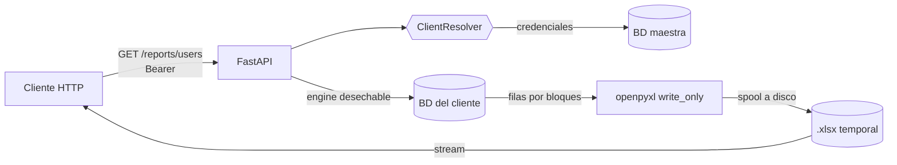

# Excel Reports Service

[](https://github.com/santiagovalenzuelalopez-gif/excel-reports-service/actions/workflows/ci.yml)


Microservicio que exporta **reportes a Excel (.xlsx)** leyendo la base de datos de **cada cliente** de una plataforma multi-cliente: listado de usuarios y registro de auditoría. Las credenciales de cada base se resuelven bajo demanda desde una base maestra.

Lo interesante no es "generar un Excel" sino hacerlo **sin que una tabla grande tumbe el servicio** y **sin que los datos de un usuario se conviertan en un vector de ataque**.



## Decisiones de diseño

| Problema | Decisión |
|---|---|
| Una tabla de millones de filas agota la memoria | Lectura por bloques (`stream_results` + `partitions`) y escritura fila a fila con `openpyxl` en modo `write_only`; sin DataFrame. Medido: triplicar la tabla **no** triplica la memoria (test incluido) |
| Excel solo admite 1.048.576 filas por hoja | Tope configurable (`MAX_ROWS`); al superarlo responde **413** sin haber leído toda la tabla (`LIMIT max_rows + 1`) |
| Un valor como `=HYPERLINK(...)` en un nombre de usuario se ejecuta al abrir el archivo (**inyección de fórmulas**) | Los textos que empiezan con `=` se escriben con tipo *texto*: se ven tal cual y nunca se evalúan. No se antepone `'`, que quedaría visible y alteraría el dato (teléfonos como `+57...` intactos) |
| Caracteres de control o celdas de más de 32.767 caracteres rompen el archivo | Se eliminan/truncan antes de escribir |
| Muchos clientes, pocas exportaciones | Engine **desechable** (`NullPool`) por exportación: no se mantienen pools abiertos por cliente |
| Contraseñas con `@`, `:` o `/` | `URL.create(...)` escapa las credenciales (concatenar cadenas produce una URL inválida) |
| La base del cliente no coincide con lo esperado | Se valida tabla y columnas con el `inspector` antes de consultar: **422** con el detalle, no un error de motor |
| Identificadores de tabla/columna | Salen de definiciones declarativas (`ReportSpec`) y se arman con `table()/column()`, nunca desde la petición |
| Filtro por letra | `lower(login) LIKE 'a%'` con la letra validada (`A-Z`): sin depender del collation y sin comodines |

Más contexto en [docs/ARQUITECTURA.md](docs/ARQUITECTURA.md).

## Ejecutar (modo demo)

```bash
pip install -r requirements-dev.txt
python scripts/seed_demo.py            # crea data/db/demo.db (2.000 usuarios, 5.000 eventos)
uvicorn app.main:app --reload
```

o `docker compose up --build` (puerto 8080; siembra la demo al arrancar).

```bash
# Usuarios cuyo login empieza por "a" (o Todos)
curl -H 'Authorization: Bearer demo-token' -OJ \
  'localhost:8000/api/v1/clients/demo/reports/users?letra=a'

# Auditoría de un rango de fechas (inclusivas, en la zona horaria del reporte)
curl -H 'Authorization: Bearer demo-token' -OJ \
  'localhost:8000/api/v1/clients/demo/reports/audit?desde=2026-03-01&hasta=2026-03-07'
```

## API

Todas exigen `Authorization: Bearer <token>` (el token **no** va en la URL: las URL terminan en logs y balanceadores).

| Ruta | Parámetros | Hoja |
|---|---|---|
| `GET /api/v1/clients/{client_id}/reports/users` | `letra` = `A-Z` o `Todos` | Usuarios |
| `GET /api/v1/clients/{client_id}/reports/audit` | `desde`, `hasta` (`YYYY-MM-DD`, inclusivas) | Auditoría |
| `GET /health`, `/version` | – | – |

| Código | Significado |
|---|---|
| 401 | Falta o es inválido el token |
| 404 | Cliente inexistente (o `client_id` malformado: misma respuesta) |
| 413 | El reporte supera `MAX_ROWS`: acota el filtro |
| 422 | Parámetros inválidos, rango > `MAX_RANGE_DAYS`, o la base del cliente tiene un esquema inesperado |
| 503 | No se pudo acceder a la configuración o a la base del cliente (sin detalles internos) |

Las fechas de auditoría se guardan como epoch en segundos y se muestran como fecha/hora nativa de Excel en la zona `REPORT_TIMEZONE`; `desde`/`hasta` cubren **días locales completos** (de 00:00:00 a 23:59:59).

## Agregar un reporte

Basta una `ReportSpec` en [`app/services/reports.py`](app/services/reports.py): tabla, columnas permitidas (columna → encabezado), una función que arma la consulta y, si hace falta, conversores por columna. El motor de exportación, el límite de filas, la validación de esquema y el saneamiento de celdas se reutilizan.

## Producción

```bash
pip install -r requirements-gcp.txt
export CLIENT_DB_BACKEND=master MASTER_DB_URL=<mysql+pymysql://... desde Secret Manager>
export IDENTITY_BACKEND=google GOOGLE_AUDIENCE=<tu client id>
docker build --build-arg REQUIREMENTS=requirements-gcp.txt -t excel-reports .
```

La BD maestra expone `client_connections(client_id, db_user, db_password, host, port, db_name, active)`. Cada base de cliente debe tener las tablas `users` y `audit_log` (ver columnas en `reports.py`).

## Tests

```bash
pytest -q       # 28 tests, sin red ni infraestructura
ruff check .
```

Cubren: ambos reportes, filtro de letra (mayúsculas/minúsculas, comodines e inyección SQL rechazados), **inyección de fórmulas**, caracteres de control y celdas gigantes, límites inclusivos del rango y conversión de zona horaria, rango inválido, 413, aislamiento entre clientes, autenticación (incluido que el token en la URL no vale), esquema inesperado (tabla y columna faltantes), fallo de base de datos sin filtrar detalles, escape de credenciales y **memoria acotada**. El warning de recursos sin liberar de Python está configurado como error en `pytest.ini`.

## Estructura

```
app/
  core/        config, logging JSON, middleware de correlación
  routers/     reports, health
  services/
    reports.py    definiciones declarativas (ReportSpec)
    export.py     lectura por bloques + escritura write_only + saneamiento de celdas
    clients.py    resolvers de credenciales (sqlite | MySQL maestra), engine desechable
    service.py    orquestación y mapeo de errores
    identity.py   verificación del token (static | Google)
scripts/seed_demo.py
```

## Licencia

MIT
